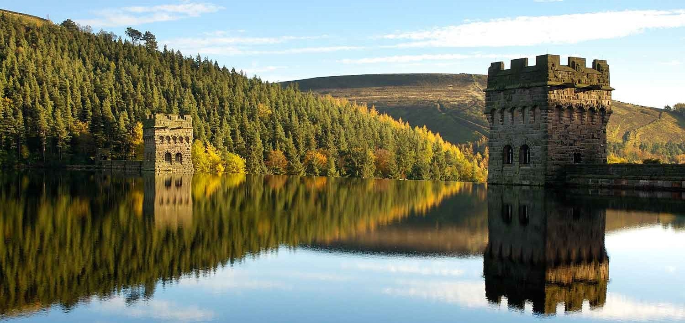

# What you said about the future of the Peak District National Park

**National Park Management Plan Consultation - Responses Report (May – July 2021)**



## Introduction
This report summarises the 1,526 responses to the Peak District National Park National Park Management Plan (NPMP) consultation that ran for a 12 week period between 20th May and 17th July 2021. The consultation was open to the general public and set out to identify the most important issues facing the Peak District to inform the development of the National Park Management Plan 2023-28 .
Using data, analysis and expert opinion, we identified 16 issues facing the Peak District. We asked the general public:
*	What are the main issues you think we should focus on in the next National Park Management Plan?
*	What are your top 3 priorities for the next National Park Management Plan?
*	Any further comments or additional issues not identified?

## What are the main issues you think we should focus on in the next National Park Management Plan?

### Overall
The level of overall agreement with the issues facing the National Park was high, with more than half of all respondents seeing each issue as important for the NPMP.  

*Figure 1: What are the main issues you think we should focus on in the next National Park Management Plan? (n=1,515)*

```chart
{
   "type":"line",
   "data":{
      "labels":[
         "JAN",
         "FEB",
         "MAR",
         "APR",
         "MAY",
         "JUN",
         "JUL",
         "AUG",
         "SEP",
         "OCT",
         "NOV",
         "DEC"
      ],
      "datasets":[
         {
            "label":"Visitor Days",
            "fill":false,
            "data":[
               0.4,
               0.55,
               0.6,
               1.08,
               1.16,
               1.01,
               1.2,
               1.16,
               1.17,
               0.81,
               0.63,
               0.51
            ],
            "borderColor":"#B14B60",
            "backgroundColor":"#B14B60"
         }
      ]
   },
   "options":{
     "plugins":{
       "datalabels":false},
      "responsive":true,
      "tooltips":{
         "mode":"index",
         "intersect":true
      },
      "scales":{
         "yAxes":[
            {
               "stacked":false,
               "scaleLabel":{
                  "display":true,
                  "labelString":"Millions (2019)"
               }
            }
         ],
         "xAxes":[
            {
               "stacked":true,
               "ticks":{
                  "maxRotation":90,
                  "minRotation":90
               }
            }
         ]
      }
   }
}
```

### Residents
Again, the level of overall agreement with the issues facing the National Park was high among residents, with more than half of all respondents seeing each issue as important for the NPMP. The issues that were viewed as the lowest priority were ‘helping to provide access to local services and broadband’ and ‘supporting diversity in our audience’, with over one third of residents selecting 'less important' or 'not important'. As with the overall results, residents agreed that nature, wildlife and maintaining natural beauty should be our highest priority. However, there were a significant number of open ended comments with the common theme of issues relating to housing and encouraging enjoyment with understanding.

*Figure 2: What are the main issues you think we should focus on in the next National Park Management Plan? (n=521 * Respondents that ticked ‘Resident’ only)*

###	Visitors
Again, the level of overall agreement with the issues facing the National Park was high among visitors, with more than half of all respondents seeing each issue as important for the NPMP.  Nearly half of all visitors thought that ‘helping to provide access to local services and broadband’ was less or not important. Visitors felt strongly about wildlife and nature-related issues, with three quarters of respondents saying this was of importance (‘Addressing the decline in numbers of some wildlife species’ (75%) and ‘Addressing nature recovery’ (73%)).

*Figure 3: What are the main issues you think the we should focus on in the next National Park Management Plan? (n= 690 * Respondents that ticked ‘Visitor’ only)*

###	Key themes emerging from responses
Over one third (526) of respondents provided further specific comments to their response. We have summarised the key themes below.

*	**Addressing nature recovery and the decline of wildlife species are the most important issues:** In response to the quantitative question, 7 in 10 responses (72%) saw these issues as ‘important’ or our ‘top priority’ for the NPMP 2023-28. No respondents thought this was ‘not important’ and only 2% thought this was ‘less important’. In total, 178 comments referred to nature recovery or the decline in wildlife species. Many were concerned with the lack of species, wildlife and habitats in the Peak District and 108 comments supported providing more opportunities for nature through rewilding or regeneration. As one respondent pointed out:

> *“Nature needs to be at the core of the new management for the park as it is the only practical solution to address the twin ecological and climate crises. This can be achieved through large scale Rewilding, nature conservation of priority habitats and sites and nature friendly farming”.*

Further responses were critical of current land management practices, with 55 comments explicating stating grouse moors and the practice of driven grouse shooting and upland heather burning as key factor in wildlife decline, specifically raptors, in the Peak District. As one respondent concluded:

> *“Absolute priority must be addressing climate issues, rewilding, stopping burning of the moors and grouse shooting, restoring peat lands & flower meadows, protecting habitats for curlews, lapwings and preventing persecution of all our wildlife”.*

There were 9 comments supporting the land management practice of grouse moor management and upland heather burning. 5 of these were supporting a statement that active management of moorlands decrease the threat of wildfire:

* “Active mgt on moorland will be less damaging than the increase in damage from wildfires.  The amount of money wasted in "green washing" is out of control, land managers have the answers through experience and knowledge learnt on the ground, they should be listened to”.*

*	**Maintaining natural beauty and enhancing our ecosystems should be focused on a wilder Peak District:** In response to the quantitative question, 9 in 10 respondents thought maintaining natural beauty should be ‘important’ or our ‘top priority’. There were 27 comments specifically relating to natural beauty and responses were varied from issues with access to the definition of what it means. However, the overwhelming number of comments were how natural beauty relates to nature recovery and management of the National Park. As one respondent suggested:

> *“I would like to see a much wilder, natural landscape with more native woodland.  I put less important for "maintaining natural beauty" not because I don't think it is important but because I don't think much of the peak district is natural landscape”.*

*	**Encouraging enjoyment with understanding is key to delivering positive outcomes for the Peak District:** Again, in response to the quantitative question, 9 in 10 respondents thought this should be ‘important’ or our ‘top priority’. A large number of comments (79) were related to visiting and enjoyment in the National Park. These were wide ranging comments but were centred on visitor behaviour or pressure on National Park communities. As one respondent stated:

> *“I believe they are all important, but the reason I placed 'Encouraging enjoyment with understanding' above the others is because it holds the key to many of the other issues.  If people understand and amend their behaviour accordingly, whether residents, businesses or visitors, they will help to underpin the achievement of the other objectives”.*

Many respondents thought educating visitors would help alleviate many of the pressures local communities and services are under, such as parking, overcrowding, litter and other visitor management issues. There were also 9 comments relating to banning BBQs, for example:

> *“I would like to see a more effort made in encouraging visitors to leave the Park immaculate - no littering, no anti-social behaviour, no parking inconsiderately, no BBQs.*

*	**Developing resilience to climate change and reducing emissions were seen as priority:** There was similar agreement between visitors (91%) and residents (88%) in response to the quantitative question that this saw these issues as ‘important’ or our ‘top priority’ for the NPMP 2023-28. There was an agreement from respondents that climate change and reducing emissions should be a cross cutting theme across all our issues and decisions. Such as:

> *“Unless we address climate change and loss of biodiversity everything else will fail”.*

> *“Minimising carbon emissions has to be an absolute priority as that supports and contributes to every other priority listed”.*

> *“Climate change and nature recovery should underpin all policies and decision making”.*

*	**Tranquillity and dark night skies are viewed as under threat by respondents:** In response to the quantitative question, both residents and visitors felt ‘tranquillity’ was of more importance over ‘dark night skies’. However, three quarters still agreed that ‘dark night skies’ saw these issues as ‘important’ or our ‘top priority’ for the NPMP 2023-28. There were few comments about tranquillity’ and ‘dark night skies. Comments were quite specific to vehicle use:

> *“Motorcycle noise is intrusive - cars would be prosecuted with noise levels like those in the Hope Valley”*

*	**Sustainable travel is important for climate change as well as visiting the National Park in a responsible way:** In response to the quantitative question, 8 in 10 respondents thought this should be a priority with 33% selecting ‘top priority’ and 49% selecting 'important'. There were 77 comments about ‘improving sustainable travel to and within the National Park’. The majority (60) of comments, were focused on public transport, better sustainable access to the Park such as buses or cycle paths and carbon free transport.  

> *“Please put active travel at the heart of everything you do and if you believe that climate change is real and that too many car journeys is a big contributor, then have the courage to say so”.*

Vehicle numbers increasing from visitors was also mentioned as a problem:

> *“An improved public transport network especially from Macclesfield may help to reduce the ridiculous numbers of cars that choke up many beauty spots every time the sun shines”.*

*	**Residents see housing as a top priority for maintaining healthy villages and communities:** In response to the quantitative question, 7 in 10 of all respondents and 73% of ‘resident’ respondents thought housing was an important issue. Many detailed comments related to addressing the issue of second homes and holiday accommodation as a factor in ensuring housing supply is available and that the market is not inflated.

> *“I think that thriving communities are important. However, I am wary of saying this when it is linked to housing. Rather than building lots more housing it would be good to restrict second home ownership to ensure existing housing stock is not priced above what people can afford, and that good homes do not stand empty for long periods. Equally holiday rentals are decimating village populations”.*

*	**Broadband and local services is a priority but both visitors and residents scored it low:** In response to the quantitative question, one third of residents thought “helping to provide access to local services and broadband” was 'not important' or 'less important'. This was even higher in visitors (45%). There were few comments relating to this issue, although some thought that community services were integral to a sustainable National Park:

> *“The National Park is about people - created and maintained by the people that live and work here.  So for a sustainable future, local communities and businesses must be supported to thrive.  That means supporting jobs, houses and broadband above all else”.*

However it may not have been seen as important for the NPMP, as other organisations have it within their remit. For example:

> *“The provision of local services and broadband is the responsibility of the local authorities, not the national park authority. This is a good example of how this authority has moved towards placing a higher priority on its one duty, than its two purposes”.*

> *“Economic prosperity is not a national park purpose, other organisations are better placed. You should maintain a strong stance on planning to protect the special qualities, and not allow relaxation of policies”.*

> *“Your focus should be on managing the Peak District National Park and not other issues that make it into the news (broadband access, etc ) - there are other agencies that (should / will) focus on that”*

## What are your top 3 priorities for the NPMP 2023-28?’
There were 1,427 respondents to this question with 54 respondents completely skipping the question. 44% of respondents’ top 3 priorities were addressing nature recovery, the decline in wildlife species and maintaining natural beauty. There were only 39 selections for ‘Helping to provide access to local services and broadband’.


*Figure 4: What are your top 3 priorities for the next National Park Management Plan? (Number of responses)*


### Do you have any other comments or priorities not listed?
There were 645 comments in total for this question with 148 selecting 'something else (write in comment box)’. No comments raised completely new issues omitted from the list. However, there were four comments from respondents that were related to health which wasn’t on the issues list provided in question 1.

*	“There's nothing in here at all in your listed priorities about sports or health. Which makes me think that you're not even considering them. Which is a real shame.”

There were 52 comments asking for greater access to open water recreation and a further 10 comments related to access and rights of way. 4 comments referencing local produce and green issues in shops, businesses or the economy which weren’t on the original issues list from question 1.

## Do you have any other comments?
There were 393 comments in total, of which 114 were not relevant to the NPMP, as they were along the lines of *“No comment”,* *“See above”* or such as *“keep up the good work”.* There were 80 further comments on access and recreation. Over half of  these were related to more access to open water swimming. However, it should be noted that the survey was shared to Facebook user group which boosted the sample size of respondents.  

*Figure 5: Table of open text comments by issue (n = 393)*

| **Row Labels**        | **Count of Issue** |
| --------------------- | ------------------ |
| N/A                   | 114                |
| Access & Recreation   | 80                 |
| Wildlife & Habitat    | 46                 |
| Engagement            | 36                 |
| Land Management       | 33                 |
| Sustainable Transport | 31                 |
| Communities           | 26                 |
| Tourism               | 17                 |
| Natural Beauty        | 4                  |
| Climate Change        | 3                  |
| Ecosystem Services    | 2                  |
| Tranquilly            | 1                  |
| **Grand Total**       | **393**            |


## How we conducted the consultation
The consultation was undertaken using an online survey and comprised of both open and closed questions. It was advertised on our website and via social media and was open between 20th May and 17th July 2021. It was open to the general public and no quotas or sample frames were employed.
The consultation was promoted in the following ways:

**Facebook**

| **Date** | **Impressions** | **Engagement** |
| -------- | --------------- | -------------- |
| 20 May   | 10,666          | 435            |
| 9 June   | 6,107           | 102            |
| 25 June  | 8,796           | 181            |
| 16 July  | 5,058           | 31             |

**Twitter**

| **Date** | **Impressions** | **Engagement** |
| -------- | --------------- | -------------- |
| 20 May   | 16,585          | 543            |
| 9 June   | 13,900          | 322            |
| 25 June  | 5,404           | 81             |
| 16 July  | 2,811           | 47             |

**Instagram**

| **Date** | **Impressions** | **Engagement** |
| -------- | --------------- | -------------- |
| 20 May   | n/a             | n/a            |
| 9 June   | 5,356           | 169            |
| 25 June  | 5,335           | 142            |
| 16 July  | 6,170           | 169            |

**LinkedIN**

| **Date** | **Impressions** | **Engagement** |
| -------- | --------------- | -------------- |
| 20 May   | n/a             | n/a            |
| 9 June   | 796             | 61             |
| 25 June  | 980             | 47             |
| 16 July  | 372             | 16             |

It was promoted on the websites of Yorkshire Water, Staffordshire Moorlands District Council and High Peak Borough Council. It was circulated by the Peak Park Parishes Forum to their contacts and to individuals who had registered an interest in being consulted on future proposals with the PDNPA Planning Service. A presentation was given to the PDNP youth forum and the survey was promoted via the PDNP Engagement Service to local schools and community contacts.

### Who responded to the consultation?
We received 1,526 responses through the online survey. This was our largest response in number of responses to a consultation survey to date. A massive 19% (285) of responses were received in the first two days of the survey being open and 247 (16%) responses were received on the final two days of the consultation. Spikes in responses were correlated with promotional / social media push dates as seen in the graph below.

Respondents were asked which of four categories best described them (visitor, resident, business owner or other). It is possible for respondents to identify with multiple categories; such as being a resident and a business owner for example. Therefore, the question was left open as ‘tick all that apply’. 18 respondents skipped this question, 236 answered more than one category and 1,272 answered one category. Further demographics of respondents were not collected as part of the survey as there were no sample quotas employed to the sample frame and we had no intention of using detailed demographic data to profile answers.

| **Who are you?** | **Percentage**  | **Number** |
| ---------------- | --------------- | ---------- |
| Resident         | 46.49%          | 701        |
| Visitor          | 56.76%          | 856        |
| Business Owner   | 6.30%           | 95         |
| Other            | 7.76%           | 117        |
| Answered: 1,508  | Response Total: | 1,508      |
